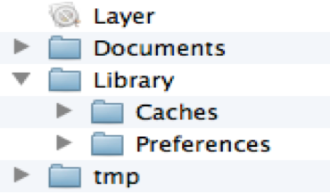

#  数据存储
- iOS应用程序中的数据存取工作是通过将数据存放到不同的目录中来完成的
- iOS应用程序数据存储的几种方式
  - xml属性列表文档（plist文件）：该文件一般存放数组和字典，并且成员必须是系统自带的类型，也就是说，自定义类型的数据是无法存放到plist文件中的
  - Preference(偏好设置)
  - NSKeyedArchiver归档(NSCoding)
  - SQLite3
  - Core Data
  - 后几项内容后续会讲到
- 在iOS中，每一个应用程序都有一个**沙盒**。每一个应用程序只能访问自己所在的沙盒，无法访问别的应用程序的沙盒，也就是说，**沙盒之间相互隔离**
- 一个应用程序的沙盒如下图所示：

- 先将各个部分依次进行说明

|  | 数据类型 | iTunes同步 | 管理方式 | 实例 |
| -- | -- | -- | -- | -- |
| Layer | mainBundle | -- | -- | 程序代码、图片资源、plist文件等 |
| Documents | 运行时生成的需要持久化的数据 | 同步 | 用户管理 | 游戏存档 |
| Caches | 运行时生成的需要持久化的数据 | 不同步 | 用户管理 | 体积大、不需要备份的非重要数据 |
| Preferences | 应用的所有偏好设置 | 同步 | 用户管理 | 应用的所有偏好设置 |
| tmp | 应用运行时所需的临时数据 | 不同步 | 系统管理 | 程序没有运行时，系统可能会清除该目录下的文件 |

- 沙盒中各个目录的访问方法
- 
