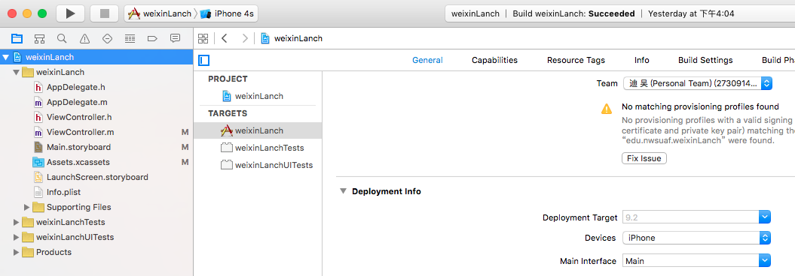
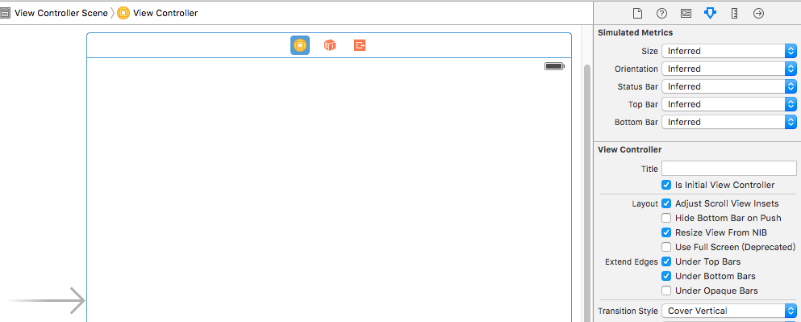

#  storyboard

### 1 程序一旦启动，首先加载的是**`Main.storyboard`**的这个文件
> 注意：

>在以后的iOS开发中，一个程序可能有很多的.storyboard文件，但是在默认情况下只有名称为`Main`的storyboard文件才会在程序启动时首先执行

>当然也可以修改程序启动时所要加载的storyboard文件，在项目-->Target-->Main Inetrface中修改

>同时还需要将箭头指向该storyboard中的某一个ViewController,点击右侧属性面板中的Is Initial View Controller

