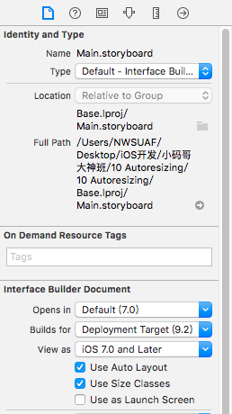
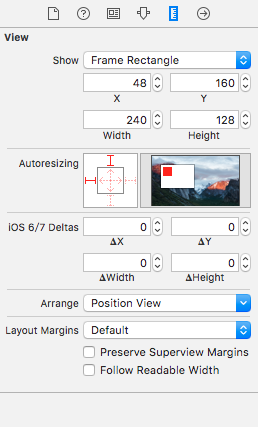

# Autoresizing
####1 介绍：Autoresizing是苹果公司推出的第一个屏幕适配解决方案
####2 使用方法
- 使用Autoresizing需要首先将Auto Layout关闭，在ViewController的右侧属性面板中关闭
- 此时，在storyboard中添加一些控件，然后在右侧的属性面板中就可以查看到Autoresizing属性

#### 3 使用说明
- Autoresizing属性面板的左侧为设置项，右侧为预览图
- 左侧的设置项一共有6条线，其中有4条外围线，正方形内部有2条线，注意内部是2条，不是4条
- 外围4条线表示控件到屏幕四周的距离，内部2条线表示控件的宽度和高度
- 外围线和内部线的实虚表示的含义是不同的
- 外围线
  - 外围线的虚线表示距离不作处理，如果4条线都是虚线，那么控件的frame就是固定死的，比如```self.button.frame = CGRectMake(50,50,100,100);```,此时控件在任何设备下都是这个frame
  - **外围线的实线表示控件到屏幕某个位置的距离是固定的**，比如若想让控件无论在任何设备的任何屏幕（横屏或者竖屏）下都位于屏幕的左上角，此时就可以将外围线的左和上设置为实线，同时在storyboard中将控件拖动到左上角
- 内部线
  - 内部线的虚线表示控件的尺寸是固定不变的
  - **内部线的实线表示控件的尺寸和屏幕的尺寸是成比例的**，比如若想让控件的宽度在任何情况下都等于屏幕的宽度，可以将内部线的横线设置为实线，并在storyboard中将控件的宽度拉长到整个屏幕

#### 4 Autoresizing的代码实现
- 在代码中同样可以使用Autoresizing技术，它通过控件的autoresizingMask属性进行设置
- autoresizingMask：它是UIView中的一个属性，专门用来设置控件的Autoresizing，它是一个UIViewAutoresizing类型（类似于枚举，但是可以多个选择）变量
```objc
typedef NS_OPTIONS(NSUInteger, UIViewAutoresizing) {
    UIViewAutoresizingNone                 = 0,
    UIViewAutoresizingFlexibleLeftMargin   = 1 << 0,
    UIViewAutoresizingFlexibleWidth        = 1 << 1,
    UIViewAutoresizingFlexibleRightMargin  = 1 << 2,
    UIViewAutoresizingFlexibleTopMargin    = 1 << 3,
    UIViewAutoresizingFlexibleHeight       = 1 << 4,
    UIViewAutoresizingFlexibleBottomMargin = 1 << 5
};
```
- UIViewAutoresizing类型中一共有7个成员变量，包括1个none，2个尺寸设置成员变量，4个位置设置成员变量
  - 尺寸设置成员变量，包括：UIViewAutoresizingFlexibleWidth、UIViewAutoresizingFlexibleHeight
    - 默认情况下，控件尺寸是固定的，只有设置控件的两个尺寸时，尺寸才会是弹性的，也就是和屏幕是成比例的
  - 位置设置成员变量：其余带有Margin的变量都是位置设置成员变量
    - 注意：
    > 与storyboard中的外围线不同，代码中控件到屏幕各边的距离默认是固定的，也就是**代码创建的控件，其Autoresizing中的4条外围线默认是实线！！**
    >
    > 比如：如果要设置控件位于屏幕的左上角，那么在代码中需要设置autoresizingMask属性的UIViewAutoresizingFlexibleRightMargin和UIViewAutoresizingFlexibleBottomMargin,也就是让右方和下方是弹性的

  ```objc
  - (void)viewDidLoad {
    [super viewDidLoad];

    UIButton * btn = [UIButton buttonWithType:UIButtonTypeSystem];
    [btn setTitle:@"测试" forState:UIControlStateNormal];
    btn.frame = CGRectMake(20, 20, 80, 20);
    btn.backgroundColor = [UIColor grayColor];
    btn.autoresizingMask = UIViewAutoresizingFlexibleBottomMargin | UIViewAutoresizingFlexibleRightMargin;
    [self.view addSubview:btn];
}
  ```
  - 上述通过代码创建了一个按钮控件，并设置了控件的
  