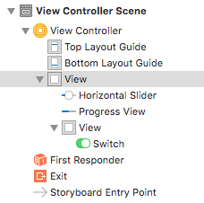
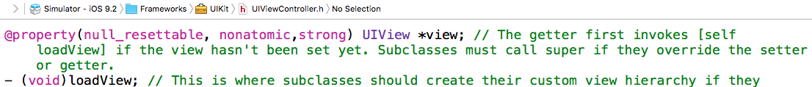

#  UIView

## 1 UIView是所有控件的父类，所有的控件最终均会继承自UIView

## 2 Apple将所有控件的基本属性都封装到UIView中，如frame，bounds，backgroundColor

## 3 每个控件都可以作为一个父控件，将其他控件作为其子空间放入该控件里面
> 注意：

> 每一个控制器内部都有一个默认的UIView控件，该控件的大小是整个手机屏幕，所有的控件都是该控件的子控件

>

> 在一个控制器相对应的 .m文件中，```self.view```就是调用控制器内部默认的UIView控件

>

## 4 常见属性
- ```@property(nonatomic,readonly) UIView * superview;```调用某个控件的父控件
- ```@property(nonatomic,readonly,copy) NSArray * subviews;```调用某个控件的所有子控件
- ```- (void)addSubview:(UIView *)view;```为某一个父控件添加子控件
- ```- (void)removeFromSuperview;```将某个控件从父控件中移除
- ```- (UIView *)viewWithTag:(NSInteger)tag;```通过tag值来需找父控件中的某个控件，其内部的实现原理如下(不一定准确，仅作说明)：
    ```objc
    if(self.view.tag == 99) 
    return self.view;
    for(UIView * view in self.view.subviews)
    {
        if(view.tag == 99)
        return view;
        break;
    }
    ```
    - 该方法表明，当父控件的tag值为某个数（如99）时，返回父控件
    - 当父控件的tag值不为给定的数值时，按照子控件在父控件中的位置从上至下（从0开始往下）查找，直到找到tag值为给定的数值时结束查找
    - 当子控件中有两个或以上的tag值符合要求时，会将子控件数组中最上面的那个控件返回 
