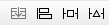
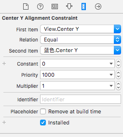
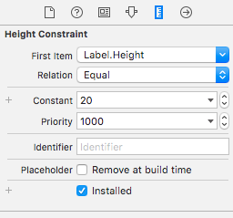
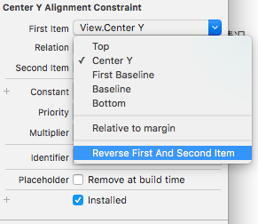
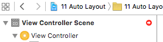
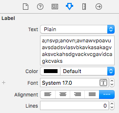
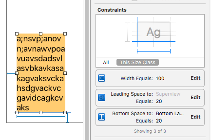

# Auto Layout

#### 1 简介：Auto Layout是苹果官方推荐使用的屏幕适配最新方案

* 在iOS6（即Xcode5.0），苹果推出了Auto Layout技术用于解决适配问题，但是由于易用性等问题，在这一版本中Auto Layout并未被广泛使用
* 在iOS7（即Xcode6.0）之后，Auto Layout技术被开发者广泛使用

#### 2 使用方法

* 在目前的Xcode（Xcode7.0）中，一个新的iOS项目一旦创建，Auto Layout默认情况就是开启的
* Auto Layout的开启和关闭
  * 在Xcode的属性控制面板中，点击第一个选项，就可以查看Auto Layout的开启和关闭
  * 在任何情况下点击属性面板的第一个选项，都可以查看到Auto Layout的开启关闭状态

* Auto Layout的使用
  * Auto Layout的使用位于storyboard文件中Interface Bulider的右下角的四个按钮，后三个按钮是Auto Layout最常使用的按钮，每一个按钮都有一个特定的功能
  * 
    * 最后一个按钮用于将已经设定好的各个约束进行各种操作
    * Selected Views：对选中的控件进行操作
    * All Views in View Controller：对位于一个View Controller中的所有控件进行操作
    * 常用操作
      * Update Frames：更新框架，即将已经设置好的各项约束在Interface Bulider中进行更新
      * Clear Constraints： 清除约束。上半部分的该选项用于清除选中控件的所有约束，下半部分的该选项用于清除一个View Controller中的所有控件的所有约束

  * 
    * 第三个按钮是Auto Layout中最常用的一个选项
    * 一般情况下会将Constrain to margins选项取消勾选，取消后的距离就是到真实屏幕的距离
    * 所有约束设置完成后需要点击最下方的Add Constraints用于将所有设置的约束添加到控件中
    * 可以通过tab键在各个选项之间进行设置，一旦设置的数据和原数据不同，该选项将会变为实线或者打钩
    * 上方部分用于设置选中控件到四周的距离，默认情况下，该距离为选中控件到该方向上距离该控件最近的一个控件的距离，如果视图中只有一个控件，那么该距离为到屏幕四周的距离。如果该控件的右边有一个控件，那么右边的距离就是选中控件到该控件的距离。
    * 可以点击每个输入框右侧的小三角来选择选中控件与哪个控件的距离
    * Width 和 Height用于设置控件的宽度和高度
    * Equal Widths 和 Equal Heights只有同时选中两个及以上控件（按住command键多选）时才会生效，用于设置多个控件相同宽度或高度
    * Update Frames用于即刻将设置的约束在视图中更新注意一般在控件的各项约束已经完成的情况下再选择更新

  * 
    * 第二个按钮用于设置控件的边缘与其他控件或父视图的关系
    * 上述灰色选项都需要选中两个及以上控件时才能使用，一般用于两个控件之间的约束问题
    * 最上面的四个选择用于两个按钮各个边缘之间的距离关系，Leading左 Trailing右 Top上 Bottom下
    * 第二块的三个选项用于设置两个按钮水平和垂直中心的关系，最后一个Baselines不常用
    * 第三块的两个按钮用于设置选中按钮和父视图（注意是父视图，而不是控制器的View）的水平和垂直关系

  * 第一个按钮为stackview
    * stackview是苹果随iOS9推出的新的自动布局技术
    * 具体内容参考: http://www.cocoachina.com/ios/20150623/12233.html

#### 3 约束修改

所有控件的约束都不在右下方四个按钮处修改，**这四个按钮的作用是添加约束，而不是修改约束**

* 约束查看
  
  * 通过Interface Builder左侧的导航面板中即可查看每个控件的约束情况，控件内部为宽高约束，与控件平级的约束为控件与其他控件的关系约束
  * 当点击某个已经设了约束的控件后，即可在视图中查看到各个约束线
  * 在右侧的属性面板中，点击倒数第二个选项，在constraints中就可以查看该控件的各个约束情况，点击右侧的Edit就可以快速更改约束数据
    * 
    * 如选中的该约束：Trailing Space to: Superview，表示右侧到父视图的距离
    * 该距离等于：Superview.trailing 乘以 Multiplier + Constant数值，目前等于Superview.trailing \* 1 + 0 = Superview.trailing。
    * **双击该选项或者点击某条约束线，在属性面板的倒数第二个选项中就可以对控件的该约束线进行深层次修改**

  *      
    * 左侧为位置关系修改面板，右侧为宽高修改面板
    * 位置修改面板用的查看方式： First Item  **Relation**  \(Second Item\) \* Multiplier + Constant 
    * 此例中：View.Center Y = 蓝色.Center Y \* 1 + 0。
    * 可以选择 Reverse First And Second Item来讲两个项目调换位置

#### 4 注意事项

* 要注意Interface Bulider左上角的圆箭头
  *    
  * 只有在约束设置完全并且视图中的控件按照约束排放后，圆箭头才不会出现
  * 黄色箭头表示约束设置正确，但是控件没有在正确的位置上，点击右下角的Update Frame就可以更新控件位置
  * 红色箭头表示约束不完全或者约束重复，此时项目是无法启动的，必须修正约束
  * 一般在右下角设置了约束后，Xcode并不会立即更新约束，需要开发者自行手动更新约束

* label控件的约束问题
  * 相对于Auto Layout来讲，在所有控件中，label控件是一个特殊的控件，因为当该控件中出现多行文字时，其控件高度是可以自适应的
  * 
  * 首先将label控件的属性面板中的Lines选项改为0（默认为1行，0表示自适应显示）
  * 此时使用Auto Layout对label控件进行约束时，只需要将其位置和宽度指定约束，而高度可以不用指定约束，这是其他控件所不能实现的，并且当控件的内容发生改变后，控件的高度会自动调整到可以完全显示内容的高度
  * 
  * 当文字内容少于一个宽度时，要想让label控件的宽度等于文字宽度，就需要对宽度进行一些设置。当前情况下，label控件的宽度固定为100，只需要将宽度改为&lt;=100，就可以实现如下效果：**当文字宽度少于控件宽度时，控件宽度等于文字宽度；当文字宽度大于控件宽度时，控件宽度为100，文字自动换行。**

