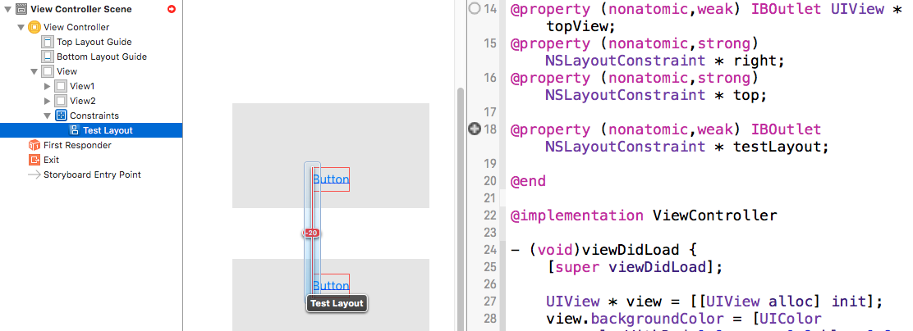
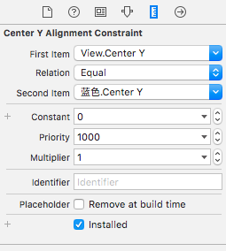

#  Auto Layout代码实现

#### 1 Auto Layout的代码原理
在storyboard中，一旦对某个控件设置了Auto Layout，那么整个视图将启用Auto Layout功能，其Interface Bulider左侧导航栏中的面板如下：


- 其中蓝色的小方块就是**约束对象**，**通过storyboard创建的Auto Layout属性是以约束对象的方式在编译过程中转换为代码，该对象是NSLayoutConstraint类型的**
- 约束既然是一个对象，那么它就可以像控件一样通过拖拽的方式添加到ViewController.m文件中，并且可以在ViewController中进行修改

#### 2 约束对象的归属
通过上图可以看到，不同的约束对象，其所属的控件是不同的
1. 所有宽度和高度的约束对象都属于设置该宽高度的控件。
  - 如上图中width = 240，height = 128，都属于TestView控件
2. 当两个控件有一个共同的父控件时，两个控件之间的约束对象属于他们所共有的父控件。
  - 如视图1.top = 视图2.bottom + 20;此时该约束对象是对两个视图进行操作，所以它不属于两个视图中的任何一个，而是属于他们共同的父视图
3. 当一个控件和它的父控件发生约束关系时，该约束对象属于其父控件。
  - 如上图中，TestView控件是View的子控件，所以TestView.leading = leadingMargin + 145，即TestView控件的左边等于屏幕左边缘 + 145，就是子控件与父控件的约束
4. 当两个控件并没有一个直接的共同父控件时，那么这两个控件之间的约束属于他们最近的一个共同父控件
  - 由于所有的控件都是在ViewController的底层View中创建，所以该View就是所有控件的父控件
  - 例：  
  - 该例中，Button1的直接父控件是View1，Button2的直接父控件是View2，所以Button2.leading = Button1.leading + 20;这条约束既不属于View1，也不属于View2，而是属于他们最近的一个共同父控件View

#### 3 约束对象的代码创建
约束对象是作用于控件上的，所以要使用约束对象必须先创建一个控件
- 控件创建
  ```objc
  - (void)viewDidLoad {
      [super viewDidLoad];
    
      UIView * view = [[UIView alloc] init];
      view.backgroundColor = [UIColor colorWithRed:0.9 green:0.9 blue:0.9 alpha:0.9];
      view.translatesAutoresizingMaskIntoConstraints = NO;
      [self.view addSubview:view];
      self.topView = view;
    }
  ```
  - 注意：
  > 1 用代码设置Auto Layout属性时，一定要在设置之前将控件的translatesAutoresizingMaskIntoConstraints属性设置为NO，该属性表示是否将Autosizing转换为Auto Layout。因为两者之间存在某些冲突，所以需要禁用该属性
  >
    >2 在添加Auto Layout之前，必须要先将控件添加到父控件中，因为在设置Auto Layout时，某些约束可能需要用到子控件与父控件之间的关系
- 约束创建
  - 约束创建通过约束对象类型NSLayoutConstraint，采用如下方法：
  ```+(instancetype)constraintWithItem:(id)view1 attribute:(NSLayoutAttribute)attr1 relatedBy:(NSLayoutRelation)relation toItem:(nullable id)view2 attribute:(NSLayoutAttribute)attr2 multiplier:(CGFloat)multiplier constant:(CGFloat)c;
```
  - 该方法参数众多，现解释如下
    - 返回值： instancetype，即返回一个NSLayoutConstraint约束对象
    - view1：需要进行操作的控件对象
    - attr1：需要进行操作的是控件对象的哪个属性，该参数是一个枚举类型，包含可控件的上下左右各边，以及宽度和高度，水平中心线和垂直中心线
    - relation：运算关系，也是一个枚举类型，包含= ， >= , <= 
    - view2：需要和view1进行约束的对象，如果是对view1的宽高进行约束，那么此参数为nil
    - attr2：view2需要进行操作的属性，如果是对view1的宽高进行约束，那么此参数为NSLayoutAttributeNotAnAttribute
    - multiplier：倍数
    - c：constant：常数
  - 该方法其实和storyboard中约束的属性面板非常相似：
  
    
  - 该方法表示的含义用数学公式表示如下：First Item  **Relation**  (Second Item) * Multiplier + Constant 
   -  此例中：View.Center Y = 蓝色.Center Y * 1 + 0。
  - 控件的约束创建如下：
    ```objc
    // height
    NSLayoutConstraint * height = [NSLayoutConstraint constraintWithItem:view attribute:NSLayoutAttributeHeight relatedBy:NSLayoutRelationEqual toItem:nil attribute:NSLayoutAttributeNotAnAttribute multiplier:0.0 constant:60];
    [view addConstraint:height];
    
    // left
    NSLayoutConstraint * left = [NSLayoutConstraint constraintWithItem:view attribute:NSLayoutAttributeLeading relatedBy:NSLayoutRelationEqual toItem:view.superview attribute:NSLayoutAttributeLeading multiplier:1.0 constant:0.0];
    [view.superview addConstraint:left];
    
    // right
    NSLayoutConstraint * right = [NSLayoutConstraint constraintWithItem:view attribute:NSLayoutAttributeTrailing relatedBy:NSLayoutRelationEqual toItem:view.superview attribute:NSLayoutAttributeTrailing multiplier:1.0 constant:0];
    [view.superview addConstraint:right];
    
    // top
    NSLayoutConstraint * top = [NSLayoutConstraint constraintWithItem:view attribute:NSLayoutAttributeTop relatedBy:NSLayoutRelationEqual toItem:view.superview attribute:NSLayoutAttributeTop multiplier:1.0 constant:0];
    [view.superview addConstraint:top];
    ```
    - 注意：
    > **在约束对象创建完成后，一定要将约束对象放到它所属的那个控件中！**
    > 
    > 本例中，height属于view控件，所以放入view控件中，而其他left，right，top都是view控件和它的父控件所发生的约束关系，所以需要将这些约束对象放入view.superview中

#### 4 约束对象更改时的动画实现
约束对象更改时，其动画的实现与普通的动画实现有所差别
```objc
/** 该方法在点击空白屏幕，即点击ViewController的最底层View控件时调用 */
-(void)touchesBegan:(NSSet<UITouch *> *)touches withEvent:(UIEvent *)event{
    
    self.right.constant = -50.0;
    self.top.constant = 20.0;
    
    // 对于NSLayoutConstraint类型的约束对象，对其执行动画操作时，只需在动画执行前将修改完成，在动画的block中添加[需要执行约束更改的View对象 layoutIfNeeded];即可
    [UIView animateWithDuration:2.0f animations:^{
//        [self.topView layoutIfNeeded];
        [self.topView.superview layoutIfNeeded];
    }];
}
```
- 注意：
> 在调用layoutIfNeeded方法时，调用该方法的对象必须是该约束所属的控件的父控件
> 
> 如上例中，self.right和self.top都属于self.topView控件和其父视图之间的约束，所以需要使用self.topView.superview来调用layoutIfNeeded方法 
> 
> 不管是对控件的四周还是宽高进行改变，都需要控件的父控件来调用layoutIfNeeded方法 