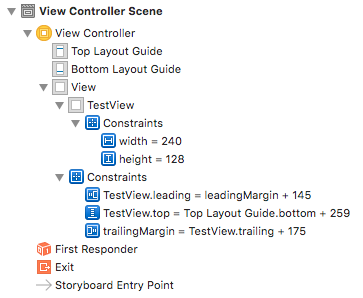
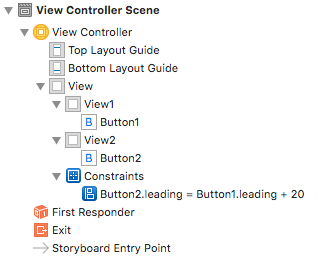

#  Auto Layout代码实现

#### 1 Auto Layout的代码原理
在storyboard中，一旦对某个控件设置了Auto Layout，那么整个视图将启用Auto Layout功能，其Interface Bulider左侧导航栏中的面板如下：

- 其中蓝色的小方块就是**约束对象**，**通过storyboard创建的Auto Layout属性是以约束对象的方式在编译过程中转换为代码，该对象是NSLayoutConstraint类型的**
- 约束既然是一个对象，那么它就可以像控件一样通过拖拽的方式添加到ViewController.m文件中，并且可以在ViewController中进行修改
#### 2 约束对象的归属
通过上图可以看到，不同的约束对象，其所属的控件是不同的
1. 所有宽度和高度的约束对象都属于设置该宽高度的控件。
  - 如上图中width = 240，height = 128，都属于TestView控件
2. 当两个控件有一个共同的父控件时，两个控件之间的约束对象属于他们所共有的父控件。
  - 如视图1.top = 视图2.bottom + 20;此时该约束对象是对两个视图进行操作，所以它不属于两个视图中的任何一个，而是属于他们共同的父视图
3. 当一个控件和它的父控件发生约束关系时，该约束对象属于其父控件。
  - 如上图中，TestView控件是View的子控件，所以TestView.leading = leadingMargin + 145，即TestView控件的左边等于屏幕左边缘 + 145，就是子控件与父控件的约束
4. 当两个控件并没有一个直接的共同父控件时，那么这两个控件之间的约束属于他们最近的一个共同父控件
  - 由于所有的控件都是在ViewController的底层View中创建，所以该View就是所有控件的父控件
  - 例：  
  - 该例中，Button1的直接父控件是View1，Button2的直接父控件是View2，所以Button2.leading = Button1.leading + 20;这条约束既不属于View1，也不属于View2，而是属于他们最近的一个共同父控件View

