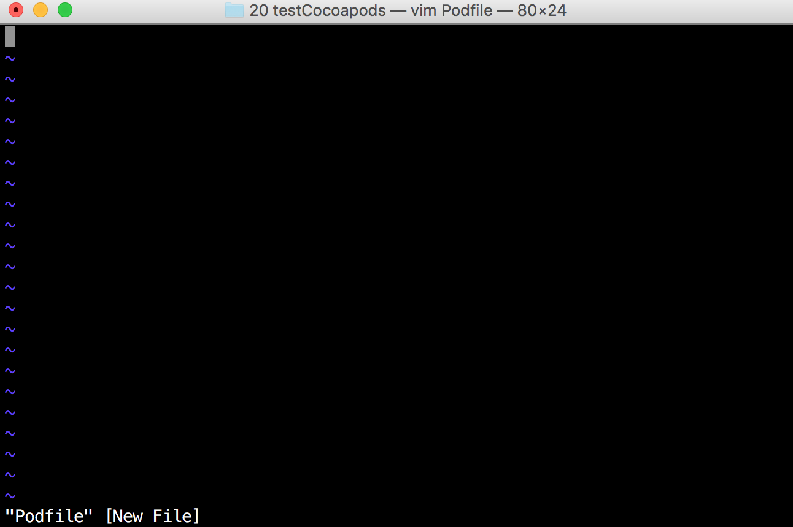
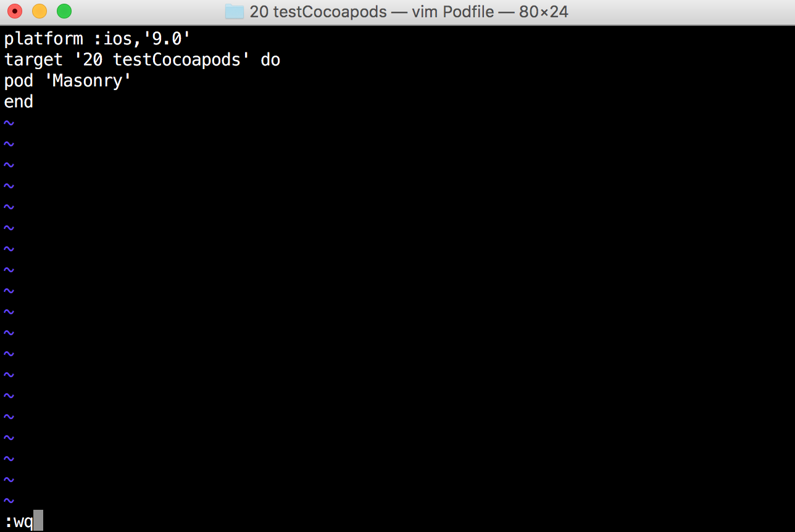
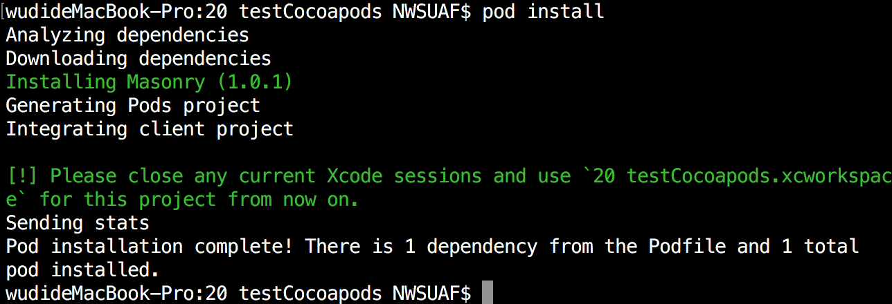

# cocoapods安装与使用
### 一、 cocoapods安装

#### 1.开启 terminal
#### 2.移除现有 Ruby 默认源
$ gem sources --remove https://rubygems.org/

#### 3.使用新的源
$ gem sources -a https://ruby.taobao.org/

#### 4.验证新源是否替换成功
$ gem sources -l

#### 5.安装 CocoaPods
$ sudo gem install cocoapods

$ pod setup

备注：苹果系统升级 OS X EL Capitan 后安装改为:

$ sudo gem install -n /usr/local/bin cocoapods

$ pod setup

> pod setup需要等待的时间有些长，耐心等待，终端没有假死

#### 6.更新 gem
$ sudo gem update --system

### 二、 cocoapods使用

#### 1.新建工程，并在终端用 cd 指令到文件夹内
如下图：

#### 2 搜索需要使用的第三方框架
$ pod search 第三方
- 如本图中搜索Masonry,可以使用：pod search Masonry

- 按Q键退出vim，回到终端界面

#### 2.新建 Podfile 文件
$ vim Podfile
> 注意：Podfile第一个字母必须大写，所有字母和空格不能缺少

- 该界面进入的vim编辑器
- 按I键进行输入，点击esc退出编辑模式
- 在非输入状态按 :键 ，然后输入 wq 保存内容并退出编辑
- vim编辑器的具体使用请百度

#### 3.编辑 Podfile 文件，并写入要添加的第三方库
platform:ios, '8.0'

target '项目名称（不要出现错误）' do

pod 'AFNetworking', '~> 2.3.1' （第三方库，并指定了版本号，也可以不指定版本号）

end

> 按esc键退出编辑模式，在非输入状态按 :键 ，然后输入 wq 保存内容并退出编辑
> 
> 可以再次输入vim Podfile进入已经新建好的Podfile文件进行编辑

#### 4.导入第三方库
$ pod install

#### 5.退出终端

