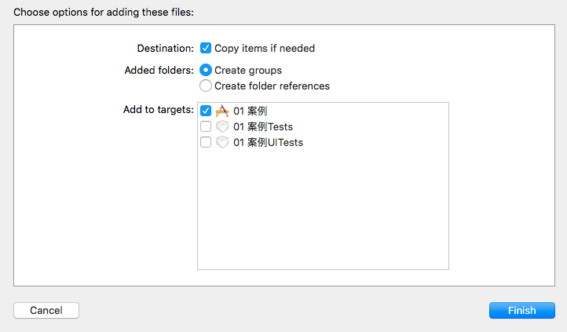
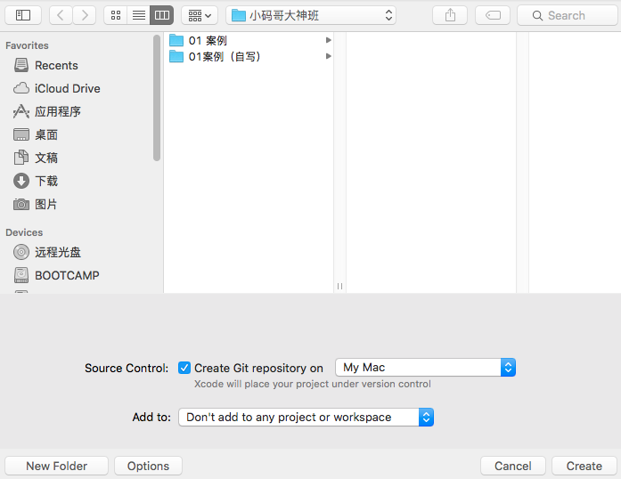
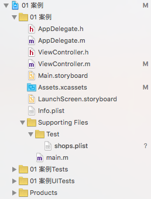
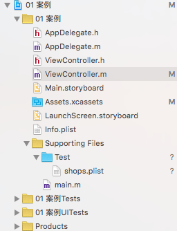
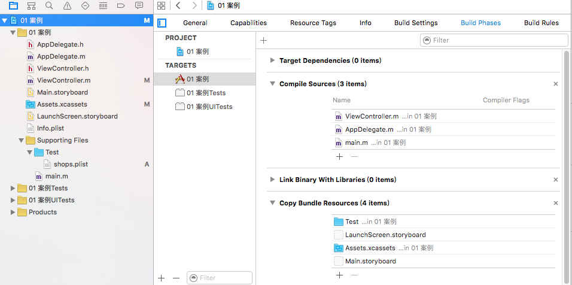
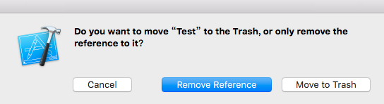

# 资源添加
#### 在iOS开发中，经常需要往程序中添加一些资源，或者新建一些文件，此时，Xcode会弹出一个选择框，如下图：

#### 每一个选项都有一些特定的功能，现逐一讲解

---
#### 1 程序的编写和编译
- 编写：编写程序就是写代码，而新建程序需要将程序存放到一个文件目录上，此时目录就是编写程序的位置，如将项目存放到桌面
    - 在新建一个项目时，编译器会要求用户选择该项目的存放位置，这个位置就是编写程序的目录
- 编译：程序编写完成后，需要运行程序来查看效果。此时会在编译器指定的一个目录中生成一个程序包
- 区别：
    - 编写程序所在的目录是用户自己设定的
    - 编译程序所在的目录是编译器自动指定的一个目录
    - 编写程序中使用的某些资源、新建的某些文件，可以选择是否将其存放到编译程序所在的目录，而非所有文件都会存放到编译程序的目录

#### 2 Destination
- destination中只有一个选项：Copy items if needed
- 含义：是否拷贝项目到编写程序所在的目录
    - 勾选表示将需要添加的文件拷贝一份到编写程序所在的目录
- **默认情况下该选项是需要勾选的**

#### 3 Added folders
- 增加文件夹，有两个选项：创建组（Create groups）和创建文件夹（Create folder references）
- 该选项针对的是文件夹添加，而非文件添加
- 创建组（Create groups）
    - 在添加文件夹时选择该选项，在Xcode导航栏中创建的文件夹是黄色的
    
    
    - 黄色的文件夹表示该文件夹在程序编译过程中是`不存在`的，文件夹中的内容全部存放在程序包的根目录中
    - 可以通过如下代码来查找到shops.plist文件的全路径
    ```objc
    // 得到程序的主包
    NSBundle * bundle = [NSBundle mainBundle];
    // 在主包的根目录下查找shops.plist文件，返回该文件的全路径给path
    NSString * path = [bundle pathForResource:@"shops" ofType:@"plist"];
    ```
- 创建文件夹（Create folder references）
    - 在添加文件夹时选择该选项，在Xcode导航栏中创建的文件夹是蓝色的
    
    
    - 蓝色的文件夹表明该文件夹在程序编译过程中是`存在`的
    - 此时通过如下代码是无法得到shops.plist文件的全路径的
    ```objc
    NSBundle * bundle = [NSBundle mainBundle];
    NSString * path = [bundle pathForResource:@"shops" ofType:@"plist"];
    ```
    此时由于shops.plist文件存放的位置是： 根目录/Test/shops.plist，所以在主包的根目录下是无法找到该文件的
- **默认情况下选择创建组（Create groups），只有在游戏开发等资源文件非常多的情况下菜使用创建文件夹选项**

#### 4 Add to targets
- 添加到程序包
- 含义：是否将文件添加到如下的几个程序包中
- **默认情况下勾选第一个，将文件添加到编译的程序包中**

#### 5 注意事项
当运行程序时，发现资源文件无法加载，可以通过以下方式查找资源文件是否存放到相应的位置
- 编写程序目录
    - 通过在Xcode导航面板中右击 -- 选择Show in Finder ，就可以来到编写程序所在的目录
- 编译程序目录
    - 一般不进入编译程序目录来查找，而是通过Xcode来进行查看
    - 通过点击Xcode导航面板上的第一个，也就是程序名称，在右侧选择Build Phases选项卡，即可查看相应的编译程序文件
    
    
        - Compile Sources（编译资源）
            - 该选项显示的是在编译程序目录中，存放的所有编译文件(.m文件)。可以通过点击+加号将编写程序目录中的.m文件添加到编译目录中
        - Copy Bundle Resources（拷贝包资源）
            - 该选项中列出的是在程序的编译目录中，所有的资源文件
            - 如果在Xcode导航中已经存在某些资源文件，但是没有添加到编译程序目录，可以点击+加号将其添加到编译目录
- 删除文件
    - 在Xcode导航栏中删除文件时，会弹出如下对话框
    
    
        - Cancel 取消删除
        - Remove Reference 从Xcode导航中删除文件，但是文件仍然存在于编写程序的目录中
        - Move to Trash 从Xcode导航栏中删除文件，**同时将文件从编写程序的目录中删除**

