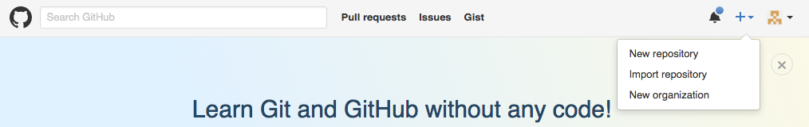
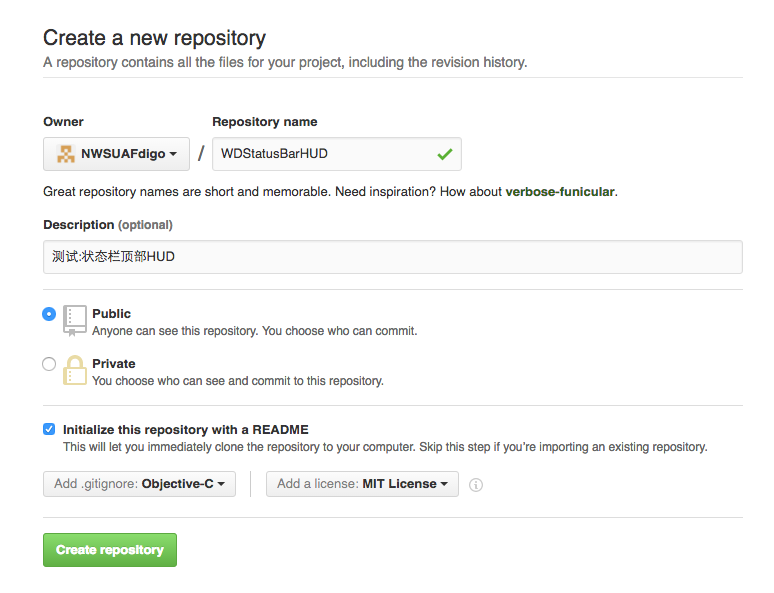
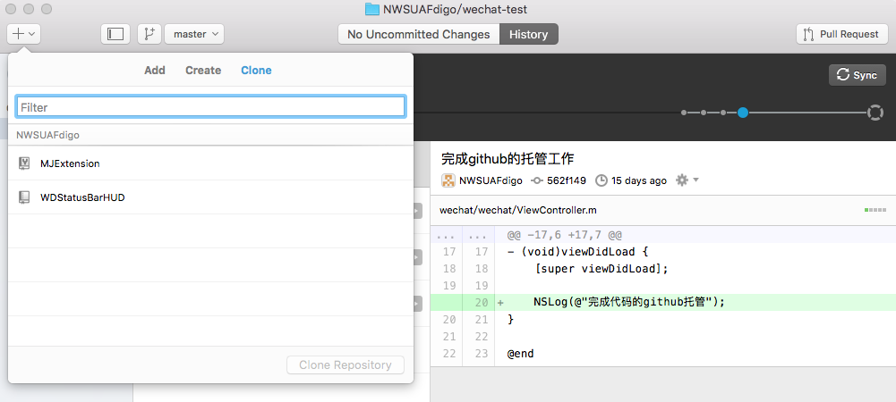
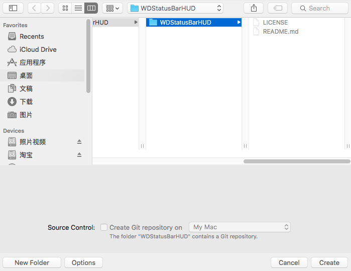
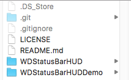
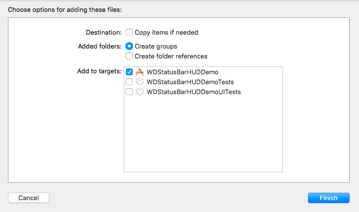
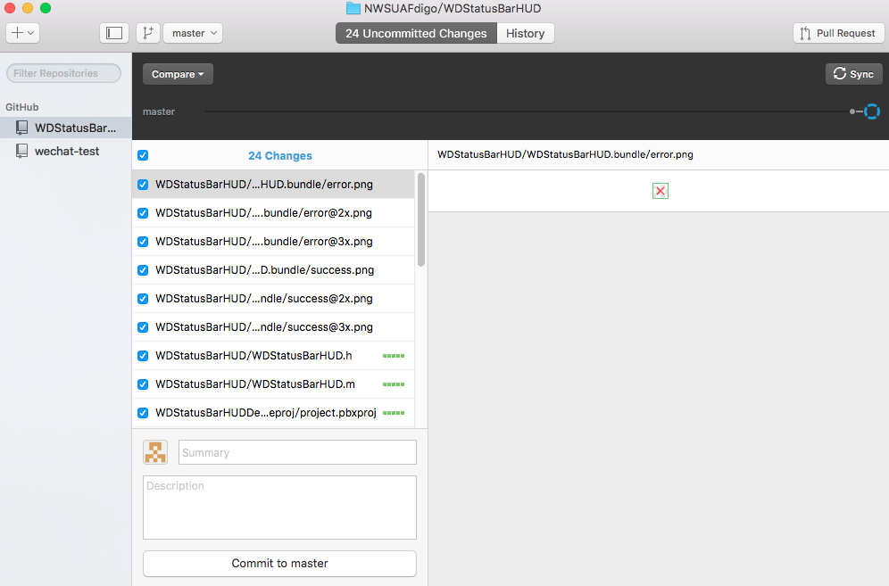
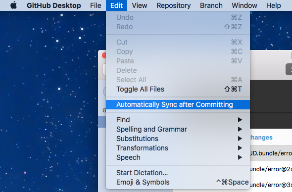

# 使用Github托管第三方框架
将自写的第三方框架WDStatusBarHUD托管到Github上
#### 1 在Github上创建仓库
- 登录Github网站,点击右上角加号,选择New repository

- 对新的仓库进行设置

  - Repository name使用框架名称 WDStatusBarHUD
  - Description(可选):添加一个描述
  - Public:公开代码 Github中,私密代码是需要收取托管费的
  - 给仓库初始化一个README文件
  - Add .gitignore:添加需要忽略的文件,选择OC
  - Add a license:添加一个许可,选择MIT,这样任何人都可以修改框架代码

#### 2 下载Github for mac客户端,在客户端上进行操作
- 将Github的远程仓库内容下载到本地

  - 点击客户端左上角的 +号,选择clone,将已经创建好的WDStatusBarHUD仓库下载到本地
  - 点击WDStatusBarHUD,点击右下的clone WDStatusBarHUD
  - 选择一个本地文件夹,作为WDStatusBarHUD的本地仓库
- 在本地仓库中创建项目,项目名称命名为WDStatusBarHUDDemo,表示是一个框架的示例程序
  
  - 由于本地仓库中已经添加Git,所以此时新建项目的底部Source Control为灰色,不能再创建新的git仓库
- 将已经写好的框架添加到仓库的根目录中(和项目同级的文件夹)
  - 仓库目录结构如下: 
- 打开Demo项目,将仓库中的WDStatusBarHUD框架添加到项目中

  - 此时不勾选 Copy items if needed.表示不将框架拷贝到项目中
  - 那么项目中使用的框架正是仓库根目录下的WDStatusBarHUD文件夹内容
  - 这么做的目的是将来修改框架时,直接修改的就是仓库根目录下的框架内容,而不必再将Demo中修改好的框架覆盖仓库根目录下的框架
- 此时就可以在Demo中使用WDStatusBarHUD框架创建一些示例程序
  - 本例中我们直接将写好的示例代码覆盖项目中的代码

#### 3 将完成的框架上传到Github中

- 打开客户端,此时在客户端中已经有需要上传的文件
  - 在Summary中书写本次操作提纲
  - 在Description中书写本次操作描述
  - 点击Commit to master,将修改和添加的内容提交到本地仓库中
  - 点击右上角的Sync,将本地仓库中的内容提交到Github服务器

- 也可以在菜单栏中选择Edit --> Automatically Sync after Committing,表示在提交到本地仓库后自动同步到Github服务器上

- 这样就完成了框架的初始化并上传操作