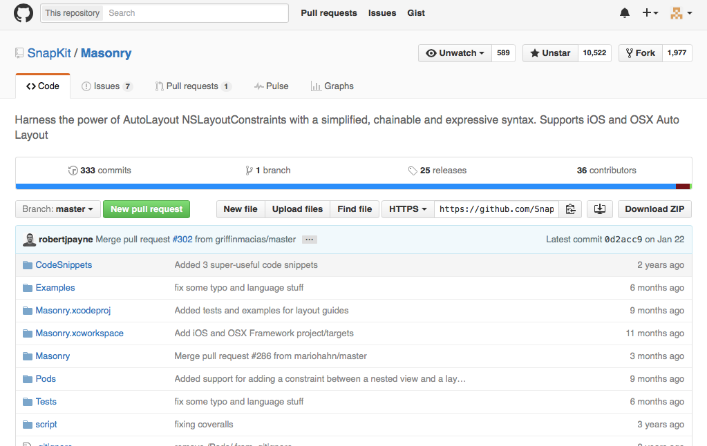

#  Auto Layout代码实现（Masonry）
#### 1 Masonry简介
Masonry是GitHub上一个非常有名的第三方框架，该框架是对苹果官方的Auto Layout代码进行封装，并提供一种更为简便的代码实现Auto Layout的方案
- 查找方法
  - 在GitHub上搜索masonry，点击第一个SnapKit/Masonry就是Masonry框架

#### 2 安装方法

1. 在GitHub上找到Masonry，点击Download ZIP，下载整个框架包
2. 框架包中与框架同名的文件夹就是整个框架的内容，本例中框架包中的Masonry就是整个框架的内容
3. 将Masonry文件夹拖拽到Xcode项目中
4. 在需要引用该框架的文件中导入框架头文件 #import "Masonry.h" 就可以使用框架了

> 在后续中可以使用CocoaPod方法来导入框架，给内容后续说明

#### 3 使用方法
每一个框架包中都包含了该框架的使用方法说明
- 点击框架中的Readme.md文件可以查看作者对于框架的大致说明
- 点击 Masonry.xcworkspace 就可以将整个框架在Xcode中打开。可以点击框架中的示例查看框架如何使用
> 由于Masonry框架中，一个项目中包含了其他项目的内容，所以单独打开一个项目是无法运行的

**Masonry框架使用方法**
1. 创建一个控件，并将控件添加到父视图中
```objc
UIView * view1 = [[UIView alloc] init];
view1.backgroundColor = [UIColor colorWithRed:0.5 green:0.5 blue:1.0 alpha:1.0];
[self.view addSubview:view1];
```
> 在使用Auto Layout方法进行控件布局时，不论使用哪种方法，必须先将控件添加到父视图中才能进行约束
> 
> 由于Masonry已将将 ```view1.translatesAutoresizingMaskIntoConstraints = NO;```进行封装，所以在创建控件时，该属性可以不用再声明
2. 使用```- (NSArray *)mas_makeConstraints:(void(^)(MASConstraintMaker *))block;```方法来设置控件约束
  - 设置控件约束的常用方法
  ```objc
  // 该方法用于设置控件的约束
  -(NSArray *)mas_makeConstraints:(void(^)(MASConstraintMaker *))block;
  // 该方法用于修改控件的约束
  -(NSArray *)mas_updateConstraints:(void(^)(MASConstraintMaker *))block
  // 该方法用于重新设置控件约束，此时，之前对于该控件的所有约束将会删除，相当于storyboard中的 Clear Constraints
  -(NSArray *)mas_remakeConstraints:(void(^)(MASConstraintMaker *make))block
  ```
3. 对控件进行约束
  - 方式1
```objc
  [view1 mas_makeConstraints:^(MASConstraintMaker *make) {
        make.left.equalTo(self.view.mas_left).offset(20);
        make.top.equalTo(self.view.mas_top).offset(20);
        make.right.equalTo(self.view.mas_right).offset(-20);
        make.height.equalTo(@60);
  }];
```
    - 方法说明
      - 通过mas_makeConstraints:方法设置约束
      - 对哪个控件进行约束，就使用哪个控件来调用该方法
      - 该方法传递一个block代码块，而代码块中包含一个MASConstraintMaker类型的参数make
      - 通过对make中的各项属性进行设置来进行控件的约束设置
    - 约束设置说明
      - 代码通俗易懂，以第一个约束为例，该句含义：让控件左边等于self.view的左边加20
      - 约束设置通过点语法来进行
      - 框架中没有self.view.left这个属性，必须使用self.view.mas_left来表示左边线
  - 方式2
  ```objc
  [view1 mas_makeConstraints:^(MASConstraintMaker *make) {
        make.left.equalTo(self.view).offset(20);
        make.top.offset(20);
        make.right.equalTo(self.view.mas_right).offset(-20);
        make.height.mas_equalTo(60);
  }];
  ```
  说明
    - 可以省略equalTo后面的mas_left，如果省略就表示是控件的某一边和另一个控件的对应的一边进行约束
    - 可以省略掉equalTo，如果省略表示是控件和其父控件进行约束
    - 除了equalTo，Masonry还提供了另外一种方式mas_equalTo
    - 两者的区别在与后者是前者的再一次包装，使用equalTo，括号中的内容必须是OC对象，所以60需要封装为@60。而使用mas_equalTo，括号中的内容可以是任何变量，Masonry会对其进行判断并封装
  - 方式3
  ```objc
  [view1 mas_makeConstraints:^(MASConstraintMaker *make) {
        make.left.and.top.equalTo(self.view).with.offset(20);
        // make.top.offset(20);
        make.right.offset(-20);
        make.height.mas_equalTo(60);
  }];
  ```
  说明
    - 对于相似约束操作，可以合并为一条约束语句，如第一句
    - and和with属性是一个空属性，其返回的还是调用该属性的self本身。作用就是用来提示，使代码看起来更通顺一些
  - Masnory中还有很多书写方法，但是**在今后开发中，为了代码的易读性，尽量使用方法3的第一条约束这种格式书写**
4. Masonry约束属性
  - Masonry中除了常规的left，right，top，bottom等约束属性外，还可以对size，center，edge等属性进行约束

####4 Masonry改进
由于Masonry中有些地方需要书写mas_ ，而有些地方又不用，很容易造成使用混乱。在以后的更新版本中提供了两个宏用于提高书写便利和代码阅读
```objc
//define this constant if you want to use Masonry without the 'mas_' prefix
#define MAS_SHORTHAND

//define this constant if you want to enable auto-boxing for default syntax
#define MAS_SHORTHAND_GLOBALS
```
> **两个宏必须写在Masonry.h头文件的前面！！**

使用第一个宏可以省略掉大部分的mas_，使代码更易读
```objc
#define MAS_SHORTHAND
#import "Masonry.h"

[view1 makeConstraints:^(MASConstraintMaker *make) {
    make.left.equalTo(self.view.left).offset(20);
    make.top.equalTo(self.view.top).offset(20);
    make.right.equalTo(self.view.right).offset(-20);
    make.height.mas_equalTo(60);
}];
```
- 使用第一个宏后，方法名和控件中的mas_就可以省略掉
- mas_equalTo还不能替换为equalTo

使用第二个宏后，mas_equalTo就可以完全等同于equalTo
```objc
#define MAS_SHORTHAND
#define MAS_SHORTHAND_GLOBALS
#import "Masonry.h"

[view1 makeConstraints:^(MASConstraintMaker *make) {
    make.left.equalTo(self.view.left).offset(20);
    make.top.equalTo(self.view.top).offset(20);
    make.right.equalTo(self.view.right).offset(-20);
    make.height.equalTo(60);
}];
```