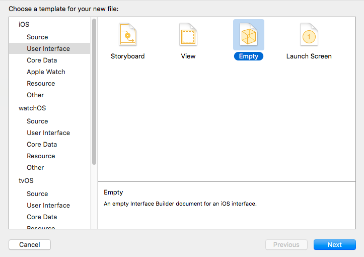
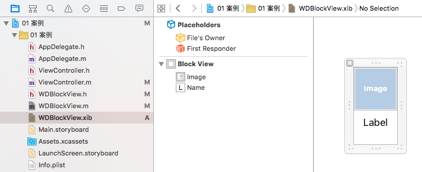
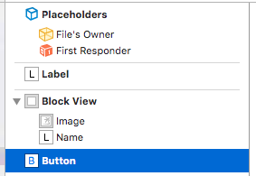
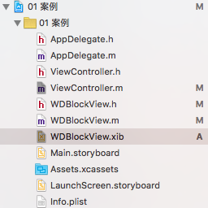
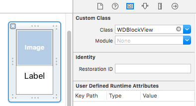

# Xib
#### 1 Xib的创建
****
在Xcode左侧的导航栏中右键，选择New File,就会弹出如下对话框：


选择User Interface，就会出现四个选项卡：
- Storyboard 创建一个storyboard文件
- View 创建一个含有一个UIView视图控件的xib文件
- Empty 创建一个xib文件，文件内部无空间
- Launch Screen 创建一个启动界面文件

其中选择**View**或者**Empty**就会创建一个**Xib**文件

#### 2 Xib文件的作用
****
xib文件与storyboard文件有许多的相似之处，但也有一些不同：
- 相同
    - 两者都可以通过图形化的方式（Interface bulider）来创建控件，并对控件的各项属性和位置等进行设置
    - 两者本质上都是xml文件，通过后期编译为纯代码的方式进行控件操作
- 不同
    - storyboard是一个重量级的，其负责的是整个界面的创建和控件添加
    - xib属于轻量级的，可以对某一个局部的视图进行专门的创建和控件添加
    
#### 3 Xib的使用方法
****
1 通过类似于storyboard的方法进行控件的创建，并进行属性设置

   - 此时创建了一个名为WDBlockView.xib的文件，并且在文件中添加了一个View视图控件，视图控件中包含一个名为image的ImageView控件和一个名为name的Label控件

2 向控制器中添加xib文件
   - 与资源文件类似，xib文件也需要通过一些方法来添加到ViewController控制器中
   - xib添加的两种方式
    - 方式1
    ```objc
    NSBundle * bundle = [NSBundle mainBundle];
    NSArray * xibArray = [bundle loadNibNamed:@"Test" owner:nil options:nil];
    NSLog(@"%@",xibArray); // 得到一个包含xib文件中所有控件的数组
    [self.view addSubview:xibArray[1]];
    ```
    - 方式2
    ```objc
    //UINib * nib = [UINib nibWithNibName:@"WDBlockView" bundle:[NSBundle mainBundle]];
    UINib * nib = [UINib nibWithNibName:@"WDBlockView" bundle:nil];
    NSArray * xibArray2 = [nib instantiateWithOwner:nil options:nil];
    NSLog(@"%@",xibArray2);
    [self.view addSubview:xibArray2[0]];
    ```
    - 此时就可以通过xibArray数组得到WDBlockView.xib文件中的所有控件，并且他们是按照控件的摆放顺序依次排列的
    
        如果某个xib文件中包含有如下控件，并且摆放的顺序如图所示，那么将xib添加到控制器时，xibArray中包含的信息如下：
    ```
    xibArray[0] = Label;
    xibArray[1] = BlockView;
    xibArray[2] = Button;
    BlockView.subviews[0] = Image;
    BlockView.subviews[1] = Name;
    ```
    
    - 注意：
    >1 xib文件是面向开发过程中的一个文件类型，xib文件在编译后将会变成nib文件，因此xib的许多方法中都包含nib
    >
    >2 无法使用pathForResource: ofType: 方法来从mainBundle中获得xib文件
    >
    >3 当方法的形参是```NSBundle *``` 类型时，可以通过nil表示mainBundle。方式2中nib的创建可以改为：```UINib * nib = [UINib nibWithNibName:@"Test" bundle:nil]; ```    
    >
    4 **只有通过以上两种方式才能将xib文件中的控件添加到控制器，进而添加到视图中**
     
**3 Xib与Xib控制器结合使用**
- 与storyboard和ViewController结合使用一样，xib文件也可以和xib控制器结合起来进行使用
- 使用方法
    - **1 首先创建一个继承自UIView的类WDBlockView**
    
    
    - 注意
    > 在创建xib控制器时，最好将控制器和xib的名称命名相同，这样可以告诉其他开发者两者是一个整体关系
    - **2 在xib文件中，将需要添加控制器的视图控件的类名称改为控制器的类名称。如选中BlockView，并在属性检查器中将Class一项改为WDBlockView（有智能提示）。**
    
    
    - 注意
    > 1 一个xib文件可以创建多个局部控件，如上文中创建了Label、BlockView、Button三个局部控件
    > 
    2 但是一个xib控制器只能对应一个局部控件，也就是说，在一个xib文件中，可以创建多个局部控件，也可以有多个xib控制器和这些局部控件相对应
    >
    3 由于BlockView控件本身是一个UIView控件，而WDBlockView类又继承自UIView，所以将为WDBlockView类作为BlockView控件的控制器，此时BlockView控件就是一个WDBlockView类型的控件
    >
    4 但是若将WDBlockView类作为其他局部控件的控制器，如上文中的Label或者Button，由于其类型不匹配，所以这些局部控件无法将WDBlockView类作为其控制器
    >
    5 一个局部控件的类（控制器）只能修改为其相应类型的类
    - **3 将xib添加到ViewController**
        - 方式1 
        ```objc
        NSArray * xibArray = [[NSBundle mainBundle] loadNibNamed:@"Test" owner:nil options:nil];
        WDBlockView * blockView = xibArray[1];
        [self.view addSubview:blockView];
        // 此时，xib文件中的BlockView控件就已经添加到视图中
        ```
        - 方式2
        ```objc
        // ViewController.m
        WDBlockView * blockView = [WDBlockView blockview];
        [self.view addSubview:blockView];
        // WDBlockView.m
        +(instancetype)blockView
        {
        NSString * str = NSStringFromClass(self); // 该函数只能用来类方法中，通过self类名来获得类名相应的字符串
        return [[NSBundle mainBundle] loadNibNamed:str owner:nil options:nil][1];
        }
        // 此时，在viewcontroller中通过类名方法就可以创建一个WDBlockView类的控件，并且该控件就是xib文件中的BlockView控件
        ```
        - 注意
        > 只有通过```- (NSArray *)loadNibNamed:(NSString *)name owner:(id)owner options:(NSDictionary *)options;```等方法才能将xib中的控件添加到控制器中
        >
        推荐采用方式2，因为方式2完整的将控件内部操作封装起来，外界只需通过一个blockview类方法接口就可以实现控件创建。外界无需知道，也不应该知道内部的具体实现细节
        
#### 4 Xib的代码原理
****
我们已经知道，xib与storyboard文件的本质是一个xml类型的文件，并且其最终还是通过代码的方式来实现控件的添加和属性的设置。

在编译过程中，xib文件中的控件也需要先初始化，那么xib文件创建的控件的初始化与通过代码创建的控件的初始化是不同的：
- 代码：代码创建的控件的初始化可以通过init方法，或者initWithFrame:方法来进行创建
- xib：xib创建的控件是通过**initWithCoder:**方法来进行创建的，并且在创建完成后还会调用一个名为**awakeFromNib**的方法
- 如果想在控件创建完成后对控件进行某些操作，那么两种方式创建的控件，代码需要添加的地方也是不同的
    ```objc
    // 通过xib创建的控件会先后调用以下两个方法
    -(instancetype)initWithCoder:(NSCoder *)aDecoder{
    if (self = [super initWithCoder:aDecoder]) {
        NSLog(@"initWithCoder");
        self.scrollView.backgroundColor = [UIColor blueColor];
        /*
         ......
         */
    }
    return self;
    }

    -(void)awakeFromNib{
        self.scrollView.backgroundColor = [UIColor blackColor];
    }
    ```
    - 通过xib创建的控件会先后调用initWithCoder:和awakeFromNib两个方法
    - initWithCoder:方法负责创建控件，通过xib或者storyboard创建的控件都是调用该方法，而不是init或者initWithFrame:
    - initWithCoder:方法中进行的是控件的创建过程，此时控件并没有完全创建完毕，控件的连线也没有实现，所以```self.scrollView.backgroundColor = [UIColor blackColor];```这一句里面，self.scrollView还没有和scrollView控件进行连线，此时self.scrollView为空，无法改变背景色
    - **awakeFromNib负责控件创建完成后的某些操作**，此时控件已经创建完成，连线也已经实现，在这个方法中修改scrollView控件的背景色是可以实现的
- 注意：
> 1 通过代码创建的控件，无论是以init还是类方法创建，其最开始一定要先调用**initWithFrame:**方法
>
所以如果使用代码创建控件，并且在控件的在init方法中添加了一个scrollView子控件，那么在initWithFrame:方法中修改子控件的颜色：```self.scrollView.backgroundColor = [UIColor blueColor];```是没有效果的，因为通过代码创建的控件会首先执行initWithFrame:方法，而此时scrollView子控件还没有创建，然后才会执行init方法
>
而如果是在initWithFrame:方法中修改控件的颜色：```self.backgroundColor = [UIColor blueColor];```是会有效果的，因为通过代码创建的控件在调用initWithFrame:方法时，控件已经创建完成，可以对控件进行某些操作
>
2 通过xib或者storyboard创建的控件，其最开始一定要先调用**initWithCoder:**方法