# SizeClass
#### 1 在Xcode中的位置
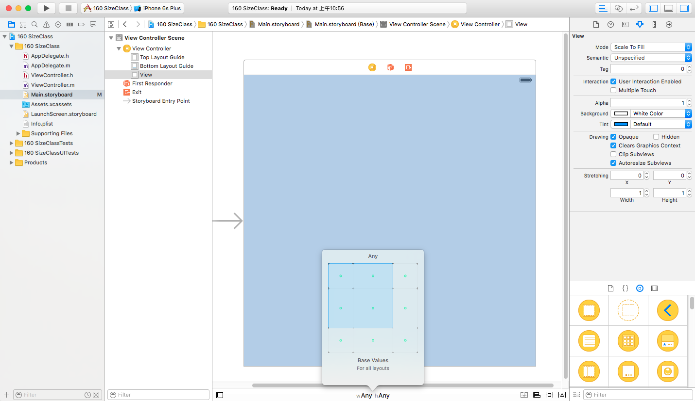
- 在main.storyboard文件中,位于interfaceBulider正下方的位置就是SizeClass的位置

#### 2 使用场景
如果想要对设备在横屏和竖屏时进行不同的布局,就需要使用到SizeClass
- 例:让一个UIView在iPhone横屏时位于屏幕左上方,iPhone竖屏时位于屏幕右下方,就需要使用SizeClass对其进行布局.使用autoLayout是无法实现这种需求的
- **注意:SizeClass只是提供了不同设备以及横屏和竖屏的不同布局方式,而具体的控件布局仍然需要使用autoLayout.所以有SizeClass必须有autoLayout,没有autoLayout必然没有SizeClass**

#### 3 如何使用
在SizeClass中,将iPhone和iPad的布局进行了统一,通过SizeClass的9个小方格的不同组合,就可以实现在不同设备之间,以及同一设备在横屏和竖屏之间的不同布局
- 宽度和高度
  - SizeClass对宽度和高度分别分为三种类型:Compact(紧凑),Any(任意),Regular(宽松)
  - 不同的宽度和高度组合就代表着不同的设备类型以及屏幕方向
  - Xcode默认启动后,SizeClass的宽度和高度分别是any和any,表示任何设备和屏幕方向都采用这种方式布局
  - 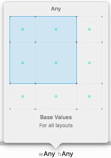
  - 所以如果SizeClass的宽度和高度都是any,就相当于没有使用SizeClass.因为SizeClass的作用就是对不同的设备和屏幕方向进行不同的布局
- 常用的宽度和高度组合
  - 所有iPhone设备竖屏
    - 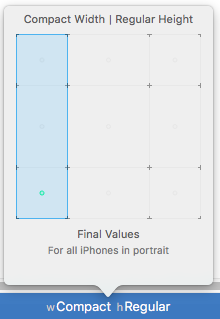
  - 所有iPhone设备横屏
    - 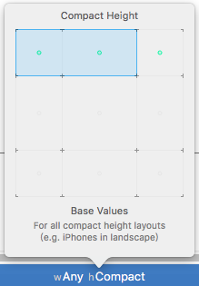
  - iPad设备横屏和竖屏
    - 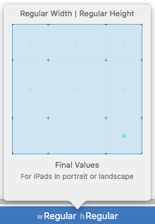
    - **注意:目前的SizeClass无法实现iPad在横屏和竖屏时分别布局,因为SizeClass没有提供这种宽高组合选项,如果要实现iPad在横竖屏的不同布局,只能使用代码**

#### 4 UIView在横竖屏使用不同布局
需求:添加一个UIView,在iPhone横屏时显示在屏幕左上方,在iPhone竖屏时显示在屏幕右下方
- 步骤
- 1 首先布局iPhone横屏
  - 1.1 调整SizeClass为iPhone横屏
  - 1.2 添加一个UIView
  - 1.3 设置UIView的约束为距离左边为0,距离顶部为0.并设置UIView的宽高值
  - 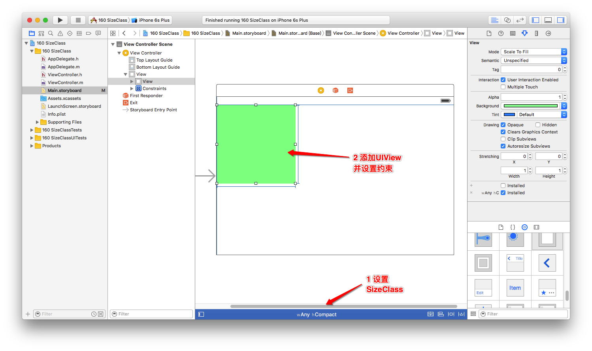
- 2 布局iPhone竖屏
  - 2.1 调整SizeClass为iPhone竖屏
  - 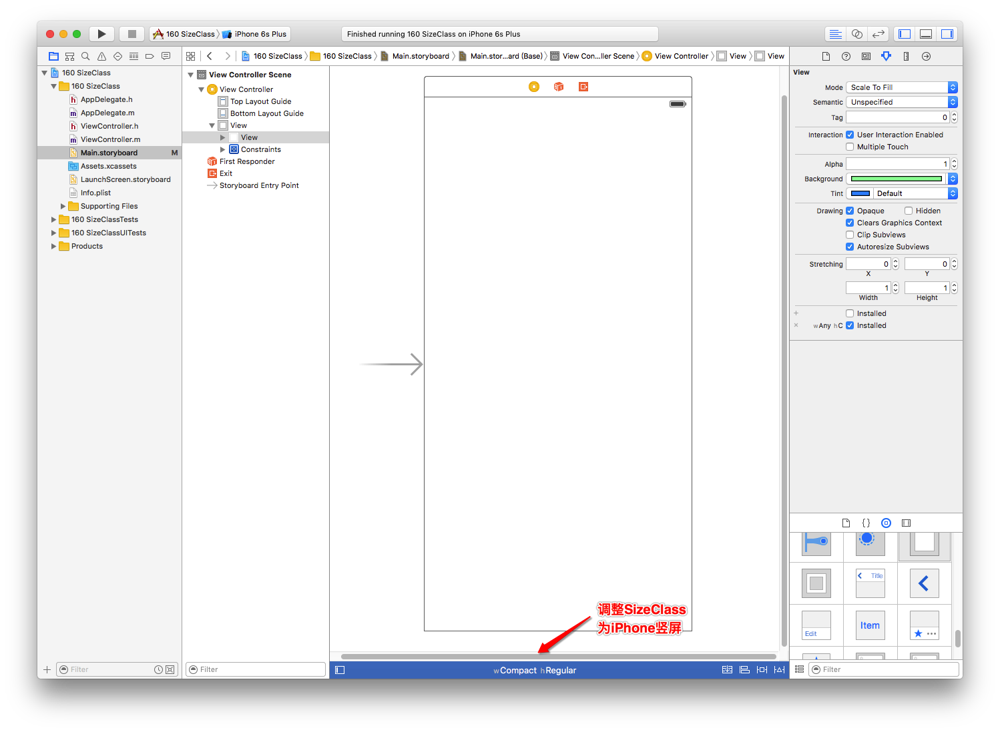
  - 2.2 此时已经添加的绿色View不见了,因为该绿色View是在SizeClass为iPhone横屏时添加的,所以如果不进行其他设置,该绿色View只会在iPhone横屏时显示
  - 2.3 选中该绿色View,并查看方框位置
  - 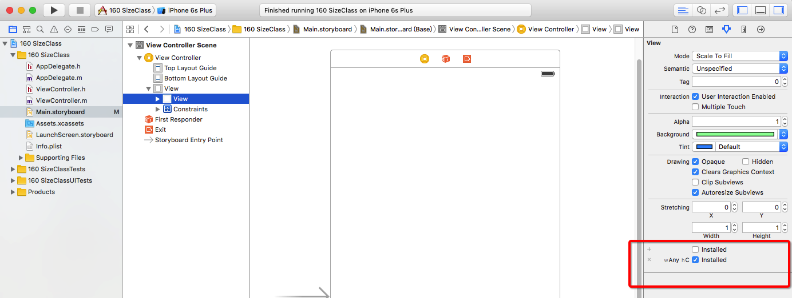
  - 2.4 可以看到,该绿色View只会在W为Any,H为C(Compact)时显示,我们需要让其在iPhone竖屏时也显示.点击+号进行添加
  - 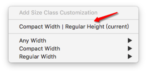
  - 2.5 选择箭头所指的选项,后面的current表示这是当前的SizeClass,也就是iPhone竖屏的情况,点击添加
  - 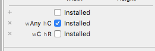
  - 2.6 添加完毕后,点击勾选,该绿色View就显示在interfaceBuilder中了,对其添加右下角的约束即可

#### 5 图片控件(如imageView)在横屏和竖屏时显示不同图片
需求:添加一个imageView,在iPhone横屏时显示一张图片,在iPhone竖屏时显示另外一张图片
- 步骤
- 1 布局iPhone横屏
  - 1.1 将SizeClass调整为iPhone横屏
  - 1.2 创建一个imageView并向其中添加一张图片
  - 1.3 布局imageView到屏幕右下方
  - 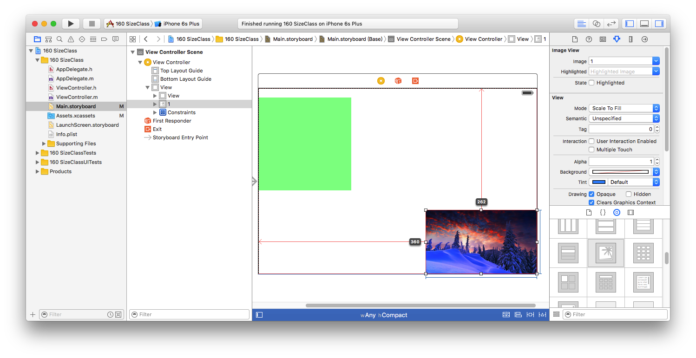
- 2 布局iPhone竖屏
  - 2.1 修改SizeClass为iPhone竖屏
  - 2.2 点击imageView,选择右侧属性面板的第4个按钮,点击最下方的+号
  - 2.3 添加当前SizeClass,并勾选install
  - 2.4 此时imageView已经显示在interfaceBuilder中
  - 2.5 给imageView添加左上角约束
  - 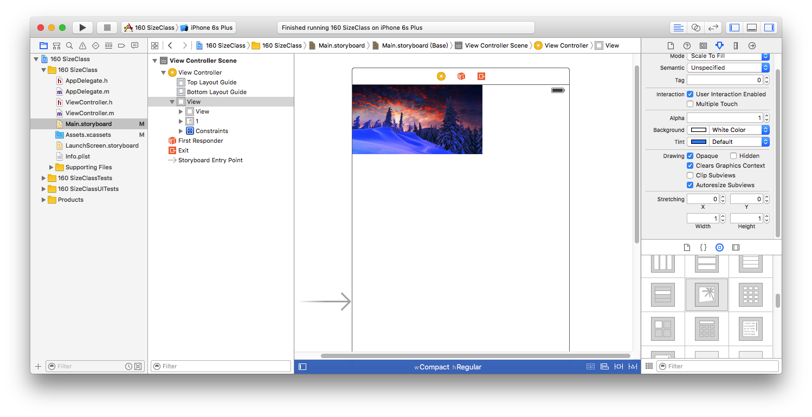
- 3 修改图片库中的图片,让其在横竖屏时显示不同图片
- 