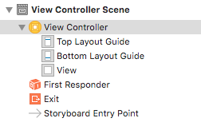

# ViewController类与storyboard的关系
#### 1 storyboard中控制器的本质
- 前文提到，当一个程序启动时，首先要加载的是main.storyboard这个文件。并且会加载storyboard文件中箭头所指向的那个控制器

- 控制器的种类是很多的，比如View Controller \ Navigation Controller \ Table View Controller可以在Xcode右下角的空间面板中看到，只要是黄色圆形图标，那么它们所表示的就是控制器

   
- 每一个控制器或者控件都对应着一个类。可以看到，通过single view application创建的项目中，默认情况下，storyboard中创建的是一个View Controller控制器，并且它属于ViewController这个类
- 一旦我们在Xcode右侧属性栏中将View Controller控制器的类名删除，就可以看到View Controller控制器本质上就是一个UIViewController类的实例对象
- **所以控制器本质上就是一个实例对象，具体是哪个类的实例对象取决于它的Class到底是谁**

#### 2 View Controller控制器与ViewController类的关系
我们知道，ViewController类是项目创建时，系统帮我们创建的，那么ViewController类和程序启动后首先加载的View Controller控制器到底是一个什么关系？
- 前文在提到xib时说道，xib不仅可以单独使用来添加到主视图中，也可以和xib控制器文件（.h和.m文件）一起结合使用。而View Controller控制器与ViewController类的关系就非常类似于这种关系
- **实际上View Controller控制器也类似于xib一样，可以不需要一个类文件而单独运行**，上例中我们将View Controller控制器的类名从Xcode右侧的属性栏中删除，可以看到其本质上是一个UIViewController类。而此时如果我们运行程序，可以看到，程序是正常运行的。并且可以在storyboard中通过拖拽的方式向View Controller控制器中添加控件，并且程序运行时控件是可以正常显示的
- **所以View Controller控制器和ViewController类并不处于一种对等关系，也就是说，View Controller控制器离开ViewController类是可以正常运行的**
- 那么ViewController类存在的作用是什么？**实际上，ViewController类的存在就是使得View Controller控制器中的控件有了可以修改和进行操作的能力**

#### 3 ViewController类研究
从ViewController.h文件中我们可以看到，ViewController类继承自UIViewController类，并且在ViewController.h文件中并没有任何的属性和方法。
- **也就是说，我们在编码过程中，对于ViewController类的所有带有提示功能的操作，其中的属性和方法均来自它的父类UIViewController**
- **ViewController类并不是UIKit框架中的一个类**，而它的父类UIViewController则是UIKit框架中的一个很重要的类。**ViewController类是一个自定义的类**，是苹果帮我们自定义的，并且帮我们将它取名为ViewController。我们当然可以修改这个类的名称，或者创建一个继承自UIViewController的一个新类，只需将storyboard中View Controller控制器的Class修改为新类的名称，那么就可以在这个新类中对View Controller控制器进行操作

#### 4 View Controller控制器与UIViewController类的关系
前文提到，View Controller控制器本质上是一个UIViewController类的实例对象。但是不是任何的控制器都可以成为UIViewController类的实例对象，想成为UIViewController类的实例对象是有条件的
- 进入UIViewController.h文件中我们可以看到，该类中有很多的方法和属性。最开始的一个属性是view。它表明要想成为UIViewController类的控制器，首先控制器中必须要有一个UIView类型的控件view。
- 而在View Controller控制器左侧的导航面板中可以看到，一个View Controller控制器创建之后就会自带一个View控件，也就是我们说的主视图。所有的其他控件都是在该控件上进行创建的
 
  
- 所以每一种控制器都是一个特定的类的实例对象。如View Controller控制器就是UIViewController或者其子类ViewController的实例对象。而Table View Controller控制器就是UITableViewController或者其子类的实例对象。
- 一种控制器只对应一种类，将View Controller控制器的类修改为UITableViewController是会出错的