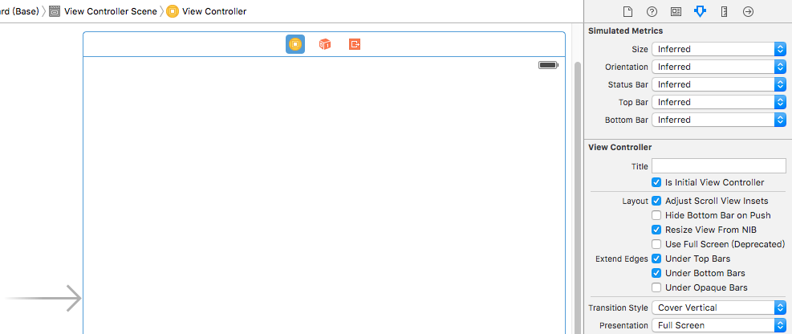
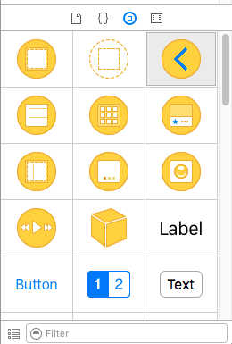
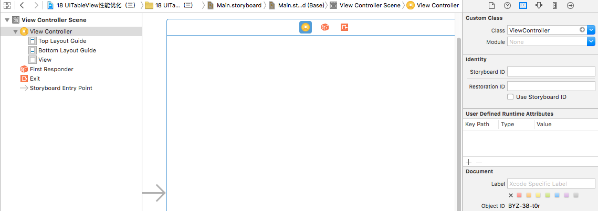

# ViewController类与storyboard的关系
#### 1
- 前文提到，当一个程序启动时，首先要加载的是main.storyboard这个文件。并且会加载storyboard文件中箭头所指向的那个控制器

- 控制器的种类是很多的，比如View Controller \ Navigation Controller \ Table View Controller可以在Xcode右下角的空间面板中看到，只要是黄色圆形图标，那么它们所表示的就是控制器

   
- 每一个控制器或者控件都对应着一个类。可以看到，通过single view application创建的项目中，默认情况下，storyboard中创建的是一个View Controller控制器，并且它属于ViewController这个类
- 一旦我们在Xcode右侧属性栏中将View Controller控制器的类名删除，就可以看到View Controller控制器本质上就是一个UIViewController类

#### 2 View Controller控制器与ViewController类的关系
我们知道，ViewController类是项目创建时，系统帮我们创建的，那么ViewController类和程序启动后首先加载的View Controller控制器到底是一个什么关系？
- 前文在提到xib时说道，xib不仅可以单独使用来添加到主视图中，也可以和xib控制器一起