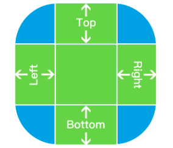
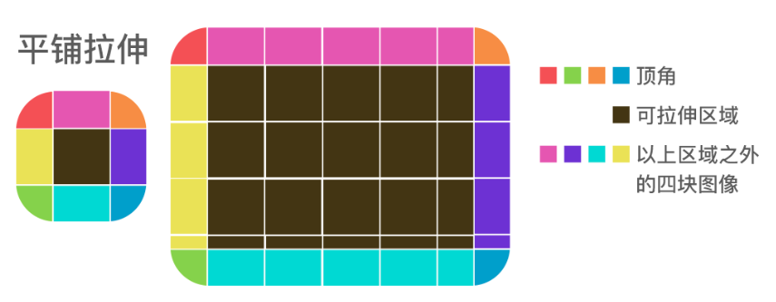
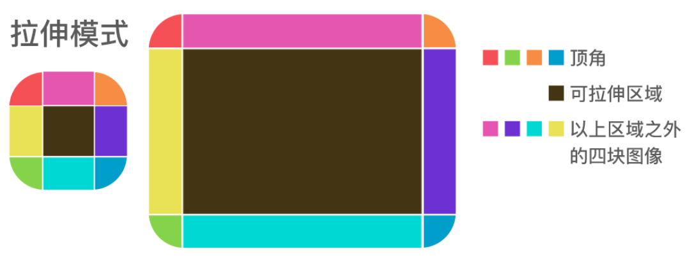

# 图片拉伸
#### 1 简介
- 在iOS开发中，对于不同的图片，其拉伸的方式是不同的。

- 下图所示的就是一个聊天气泡，对于这种类型的图片，使用传统的拉伸显然是不合适的

  
- 对于这种聊天气泡图片的放大，苹果提供了三种方式对其进行拉伸
- 图片拉伸所进行操作的对象是UIImage
  
#### 2 图片拉伸的方式一
```- (UIImage *)resizableImageWithCapInsets:(UIEdgeInsets)capInsets resizingMode:(UIImageResizingMode)resizingMode```
- 该方法是苹果最新推出的一种图片拉伸方法，于iOS6.0之后推出
- 需要使用一个UIImage对象来调用该方法
- 该方法返回一个新的UIImage对象
- 形参说明：
  - capInsets：该参数表示图片中可拉伸的范围，即哪些区域是会随着图片的放大而拉伸的，在拉伸范围外的图片内容就是受保护的，是不会随着图片的放大而拉伸的
  - resizingMode：拉伸模式。该方法提供了两中拉伸模式：UIImageResizingModeTile 平铺模式（**默认模式**、 UIImageResizingModeStretch 拉伸模式
- 可拉伸范围需要我们使用```UIEdgeInsetsMake(CGFloat top, CGFloat left, CGFloat bottom, CGFloat right)```方法来进行设置，其各个参数在图片中的表现如下图：

  
  - 图中的绿色部分就是可拉伸的区域
  - 图中的蓝色部分就是受保护的区域，该区域是不会被拉伸的
  - top\left\bottom\right表示的是图像的各个边相对于对应边来说，向内部嵌入的距离。
  - 如：UIEdgeInsetsMake(10,20,10,15)就表示top边向内嵌入10个点距离，left边向内嵌入20个点距离，bottom边向内嵌入10个点距离，right边向内嵌入15个点距离
- **平铺模式下图像拉伸的规则**
  
  
  - 上图所示为平铺模式，也就是UIImageResizingModeTile的图片放大规则
  - 此时图像有三种放大模式：
    - 顶角：各个顶角的图像不进行放大，原样放置于拉伸图像的各个顶角
    - 中间可拉伸区域和各个顶角以外的四块图像，拉伸整个图像时，他们按照从左到右、从上到下的顺序一块挨着一块进行放置，最后一块多余区域会才减掉
    - 可拉伸区域：按照从上到下、从左到右的顺序一块接一块拼接，多余部分删掉
    
- **拉伸模式图片拉伸规则**
  
  - 上图所示为拉伸模式的图片放大规则
  - 四个顶角同样保持不变
  - 四块图像按照单一方向，横向或纵向拉伸
  - 可拉伸区域按照横向和纵向双向拉伸

#### 3 图片拉伸的方式二
```- (UIImage *)resizableImageWithCapInsets:(UIEdgeInsets)capInsets```
- 该方法相比较于方式一少了一个模式选择
- 该方法默认的模式为平铺模式
- 该方法在iOS5.0之后引入

#### 4 图片拉伸的方式三
```- (UIImage *)stretchableImageWithLeftCapWidth:(NSInteger)leftCapWidth topCapHeight:(NSInteger)topCapHeight```
- 该方法的图片放大模式为拉伸模式
- 相比较于以上两个方法，该方法只需传入两个数值：leftWidth和topHeight，相当于```UIEdgeInsetsMake(CGFloat top, CGFloat left, CGFloat bottom, CGFloat right)```中的left和top的值
- 该方法中，其余两项的值是通过计算得到的
  - right = width - left - 1;即right + left + 1 = width
  - bottom = height - top - 1;即bottom + top + 1 = height;
- 通过上述两个公式可以知道，左右两条线之间间隔了宽度为1个点的一条竖线
- 上下两条线之间间隔了高度为1个点的一条横线
- 也就是说，该方法中，可拉伸区域是一个点，而四块其他区域的图像都是一条线
- 该方法的使用一般是讲leftWidth和topHeight的值设置为宽度和高度的0.5，也就是让可拉伸区域的点位于图像的正中心点
- 该方法从iOS开发至今一直存在
  


