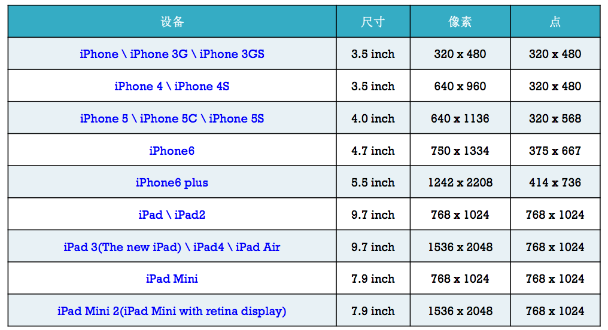

# App图标和启动画面
#### 1 屏幕的物理分辨率和点之间的关系
- 点这个概念是苹果针对iOS开发者提出的一种视图中控件的大小以及位置的解决方案
- 下表所示为不同的设备上，像素和点之间的关系

 
    
- 在iOS设备中，屏幕的物理分辨率和点之间存在着一种关系
  - 在有些设备，如早期的iPhone3GS、iPad1代等，屏幕的物理分辨率，也就是像素和点之间是1：1的关系
  - 而到了采用retina屏幕的iOS设备时，点和像素之间是1：4的关系，即一个点是有4个像素组成
  - iPhone Plus版本出现后，点和像素之间的关系变为了9：1
- 点概念出现的背景
  - 在早期的iOS设备中，一个点对应着一个像素，开发者只需要按照屏幕的物理分辨率进行视图设计就可以了
  - 当iPhone4出现后，在3.5寸的屏幕上，屏幕开始变得更加清晰。物理分辨率提高了，即水平方向和垂直方向上的像素点分别是非retina屏幕的2倍
  - 此时如果采用物理分辨率作为开发的依据，那么在当时只有两种分辨率的时代，要做到对于两种屏幕都要适配，就必须对iPhone3GS等非retina屏幕的设备进行全方位的修改，应用程序中的所有控件的尺寸都必须重新设计
  - 这对于开发者来讲，是一件非常枯燥并且浩大的工程
  - 为了解决这个问题，苹果就退出了点概念

