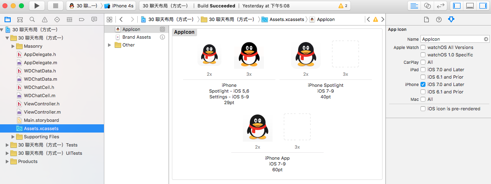
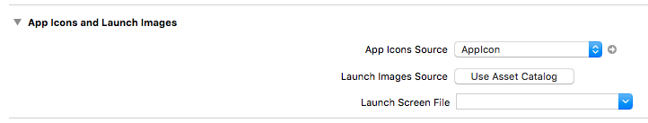
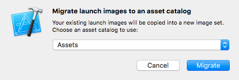
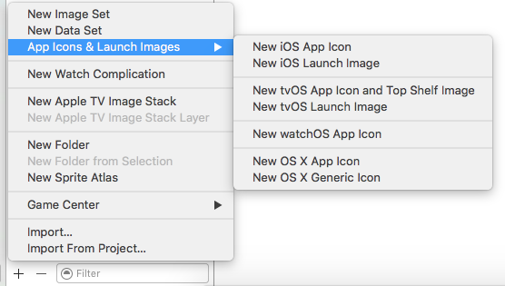
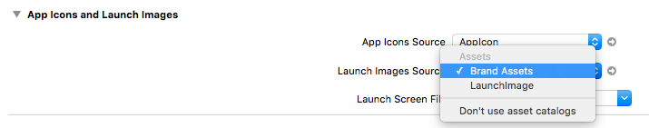

# App图标和启动画面
#### 1 屏幕的物理分辨率和点之间的关系
- 点这个概念是苹果针对iOS开发者提出的一种视图中控件的大小以及位置的解决方案
- 下表所示为不同的设备上，像素和点之间的关系

 
    
- 在iOS设备中，屏幕的物理分辨率和点之间存在着一种关系
  - 在有些设备，如早期的iPhone3GS、iPad1代等，屏幕的物理分辨率，也就是像素和点之间是1：1的关系
  - 而到了采用retina屏幕的iOS设备时，点和像素之间是1：4的关系，即一个点是有4个像素组成
  - iPhone Plus版本出现后，点和像素之间的关系变为了9：1
- 点概念出现的背景
  - 在早期的iOS设备中，一个点对应着一个像素，开发者只需要按照屏幕的物理分辨率进行视图设计就可以了
  - 当iPhone4出现后，在3.5寸的屏幕上，屏幕开始变得更加清晰。物理分辨率提高了，即水平方向和垂直方向上的像素点分别是非retina屏幕的2倍
  - 此时如果采用物理分辨率作为开发的依据，那么在当时只有两种分辨率的时代，要做到对于两种屏幕都要适配，就必须对iPhone3GS等非retina屏幕的设备进行全方位的修改，应用程序中的所有控件的尺寸都必须重新设计
  - 这对于开发者来讲，是一件非常枯燥并且浩大的工程
  - 为了解决这个问题，苹果就退出了点概念
- 点概念的原理
  - 从上表中可以得知，iPhone4的点分辨率仍然为320x480
  - 这样做以后，对于开发者来讲，由于开发时用到的分辨率和iPhone3GS等老设备一样，那么在开发中就不需要对项目进行修改
  - 原来的frame为（10，20，50，50）的某个控件，在retina屏幕的项目开发中仍然为（10，20，50，50）
  - 此时就存在一个问题，原来设计的针对非retina屏幕的应用程序，虽然在项目开发时，应用程序的尺寸没有发生变化。但是由于物理分辨率的提高，所以实际上，在retina屏幕中显示时，需要将原有的所有的控件的宽高扩大2倍，面积扩大4倍。这就等于将原有控件进行拉伸
  - 比如原来设计的100x100物理分辨率的某个图片，在retina屏幕中需要将图片拉伸为200x200的物理分辨率，那么图片的清晰度必然受到影响
- 点分辨率问题的解决方案
  - 为了解决出现的图片清晰度问题，苹果采用了两种方法
  - 针对系统控件，苹果对所有控件进行优化，让系统控件在retina屏幕上仍然清晰
  - 针对自定义控件，以及图片资源，苹果要求开发者提供两种分辨率的图片，然后根据设备的不同显示不同的图片
- **图片资源的命名规范**
  - 由于有非retina屏幕、retina屏幕、plus屏幕三种屏幕格式，所以在提供图片资源时，苹果也要求对于同一个内容的图片，提供三种分辨率格式
  - 对于非retina屏幕，图片的名称由开发者自己定义
  - 对于retina屏幕，同一张内容的图片，要求在图片的末尾加上**@2x**
  - 对于plus屏幕，同一张内容的图片，要求在图片的末尾加上**@3x**
  - 例：某张图片命名为 test.png。那么retina屏幕上，该图片的名称应该为test@2x.png。plus屏幕上该图片的名称应该为test@3x.png
  - 在代码中使用该图片时，只需指定图片名称，不需要加上@2x,@3x。如UIImage *image = [UIImage imagenamed:@"test"]; 由于三种分辨率的该图片都有，所以系统会自动根据设备型号来判断显示那张图片

#### 2 应用图标
- 应用图标需要开发者自行提供，而存放的位置如下图所示：

- 在项目的左侧导航栏中选择图片资源目录，在导航栏右侧的小导航栏中就可以看到AppIcon目录
- 应用程序的图标就存放在这个目录中
- 在右侧的属性面板中，可以对所有的苹果设备进行图标设置，此时我们只是针对iOS7.0以后的iPhone设备进行了设置
- 可以看到，在iOS7.0以后的iPhone设备中，需要提供三种样式的图片，分别用于spotlight和应用程序图标，并且要求提供29x29 、 40x40 、 60x60三种分辨率下的图片
- 在每一种分辨率下，都需要提供2x和3x两种类型的图片。在29pt的样式下，2x图片的分辨率为58x58，3x图片的分辨率为87x87

#### 3 启动界面
苹果提供了两种方法来设置启动界面，一个是在左侧导航栏中的LaunchScreen.storyboard，另一个在图片资源目录下的Launch Images目录
- LaunchScreen.storyboard
  - 该文件相当于一个xib文件，就是添加启动画面用的
  - 由于不同的屏幕需要适配不同的启动画面，所以很少使用这种方式来设置启动画面
- Launch Images
  - 该方法类似于应用图标的添加方式
  - 默认情况下，系统选择LaunchScreen.storyboard这种方式来创建启动画面，当然我们可以更改为Launch Images目录
  - 点击左侧导航栏的第一个项目文件，选择TARGETS第一个项目，然后选择General选项卡，就可以看到如下界面：
 
  - 其中第一个选项App Icons Source就是应用程序图标的目录。默认情况下，在图片资源目录中已经创建了AppIcon目录用于存放应用程序图标
  - 第二个选项为启动画面目录。默认情况下，启动画面目录没有创建，需要手动进行创建
  - 第三个选项为启动画面文件，默认为LaunchScreen.storyboard
  - 如果我们需要使用图片资源中的启动画面目录作为启动画面，那么首先需要将第三个选项，启动画面文件删除，该选项为空
  - 然后在第二项中点击Use Asset Catalog，出现以下画面
   
  - 可以使用已经创建好的资源目录Assets，也可以新建一个资源目录。然后点击Migrate就创建完成
  - 此时创建的启动画面目录名称为Brand Assets
- 修改启动画面目录为LaunchImage
  - 首先需要在启动画面目录中创建LaunchImage目录
   
  - 点击图片资源目录下方的加号，选择所需要创建的启动画面
  - 然后点击左侧导航栏的第一个项目文件，选择TARGETS第一个项目，然后选择General选项卡，修改启动画面为Launch Images Source，并创建一个启动画面目录
  - 由于此时创建的启动画面目录名为Brand Assets，可以点击Launch Images Source右侧的上下箭头，弹出如下画面：
   
  - 选择LaunchImage就可以用LaunchImage作为启动画面的目录